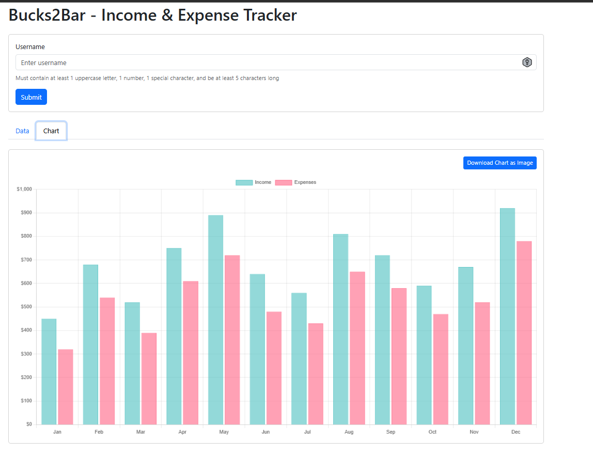
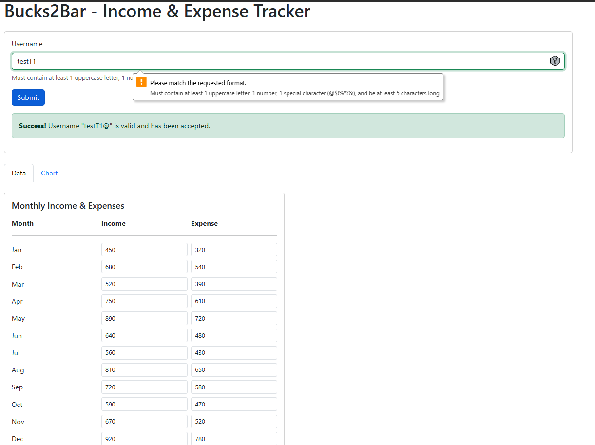

# Bucks2Bar - Income & Expense Tracker


A simple, client-side web application for tracking monthly income and expenses with interactive chart visualization. This project was developed entirely using GitHub Copilot with no manual coding.

## Features

### 📊 Monthly Budget Tracking

- Track income and expenses for all 12 months (January - December)
- Simple input fields with pre-populated sample data
- Number inputs for easy data entry

### 🔐 Username Validation

- Strict validation with regex pattern enforcement (for testing purposes only)
- **Requirements:**
  - Minimum 5 characters
  - At least 1 uppercase letter
  - At least 1 number
  - At least 1 special character (`@$!%*?&`)
- Real-time feedback with Bootstrap validation states
- Dynamic success/error messaging

### 📈 Interactive Chart Visualization

- Beautiful bar chart comparing income vs expenses
- Built with Chart.js 4.4.1
- Color-coded datasets:
  - Income: Teal/cyan bars
  - Expenses: Red/pink bars
- Currency formatting with dollar signs
- Responsive design with maintained aspect ratio
- Tooltips with formatted values

### 💾 Export Functionality

- Download chart as PNG image
- Automatic filename with current date: `budget-chart-YYYY-MM-DD.png`
- One-click export from the Chart tab

## Screenshots

### Chart Visualization



### Username Validation - Success


### Username Validation - Error



## How It Works

### DOM-Driven Data Storage

- Input values are stored directly in HTML `<input>` elements
- No backend or database - purely client-side
- Data persists only while the browser tab is open

### Event-Driven Chart Updates

- Chart updates automatically when switching to the Chart tab
- Uses Bootstrap's `shown.bs.tab` event listener
- The `updateChart()` function reads all 24 input values (12 income + 12 expense)
- Values are parsed and synchronized to Chart.js datasets
- Chart re-renders with updated data

### Data Flow

1. User enters income/expense values in input fields
2. Values stored in DOM element `value` attributes
3. Tab switch triggers `shown.bs.tab` event
4. `updateChart()` extracts all values via `getElementById()`
5. Chart.js datasets updated with new data
6. `budgetChart.update()` re-renders the visualization

## Technical Stack

**Front-End Libraries (CDN):**

- [Bootstrap 5.3.2](https://getbootstrap.com/) - UI framework, tabs, forms, alerts
- [Chart.js 4.4.1](https://www.chartjs.org/) - Bar chart rendering

**Core Technologies:**

- HTML5 - Semantic structure with form validation
- Vanilla JavaScript (ES6) - No framework dependencies
- CSS - Bootstrap only (no custom stylesheets)

**Testing:**

- [Jest 30.2.0](https://jestjs.io/) - Testing framework
- jest-environment-jsdom 30.2.0 - DOM simulation
- canvas 3.2.0 - Chart.js testing support

## Getting Started

### For End Users

1. **Open the application**

   - Simply open `index.html` in any modern web browser
   - No installation or server required

2. **Set a username**

   - Enter a username meeting the validation requirements
   - Click Submit to validate

3. **Enter your financial data**

   - Modify income/expense values for any month
   - Default sample data is pre-populated

4. **View the chart**

   - Click the "Chart" tab to see the visualization
   - Income (teal) vs Expenses (pink) displayed side-by-side

5. **Export the chart**
   - Click "Download Chart as Image" button
   - PNG file saved to your downloads folder

### For Developers

**Install dependencies:**

```bash
npm install
```

**Run tests:**

```bash
npm test                  # Run all tests once
npm run test:watch        # Watch mode (re-runs on changes)
npm run test:coverage     # Generate coverage report
```

**No build process needed:**

- Edit HTML/JS files directly
- Refresh browser to see changes
- All dependencies loaded via CDN

## Project Structure

```
GHCopilot/
├── index.html              # Main UI with Bootstrap tabs
├── script.js               # All JavaScript functionality
├── script.test.js          # Jest unit tests
├── package.json            # Dependencies & npm scripts
├── jest.config.js          # Test configuration
├── .gitignore              # Git ignore rules
├── .github/
│   └── copilot-instructions.md  # Development guidelines
└── images/                 # Screenshots for README
    ├── chart-visualization.png
    ├── username-validation-success.png
    └── username-validation-error.png
```

## Testing

The project includes comprehensive Jest tests for the username validation functionality:

- ✅ Valid username scenarios (5 test cases)
- ❌ Invalid username scenarios (7 test cases)
- 🔄 Message div handling (3 test cases)
- 🎨 CSS class toggling (2 test cases)
- 🛡️ Event prevention (1 test case)

**Run the test suite:**

```bash
npm test
```

## Known Limitations

- **No data persistence** - Refreshing the page loses all changes
- **Client-side only** - No database, cloud sync, or sharing capabilities
- **Manual chart refresh** - Chart updates only on tab switch, not on input change
- **Fixed 12-month structure** - Cannot add/remove months dynamically
- **No authentication** - Username validation is cosmetic (no actual login)
- **No data export** - Can only export chart as image, not raw data

## Browser Compatibility

Requires a modern browser supporting:

- ES6 JavaScript (arrow functions, `let`/`const`, template literals)
- HTML5 Canvas (for Chart.js)
- HTML5 form validation (pattern attribute)
- Bootstrap 5 compatibility (CSS Grid, Flexbox)

## Development Notes

This project demonstrates:

- Pure client-side web development
- DOM manipulation with vanilla JavaScript
- Event-driven programming patterns
- Chart.js integration for data visualization
- Bootstrap component usage (tabs, forms, alerts)
- Regex pattern matching for validation
- Jest testing with jsdom

---

**Built entirely with GitHub Copilot** - A demonstration of AI-assisted development with zero manual coding.
